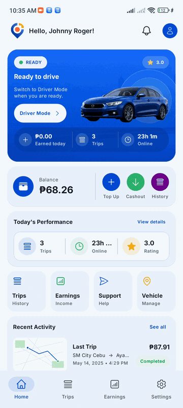
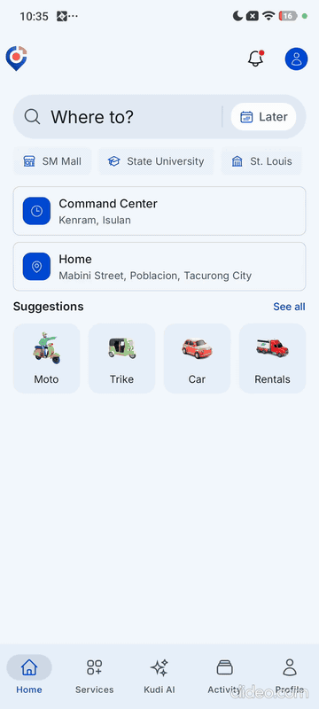

# ESK Transport Mobile App

ESK Transport is a ride-hailing mobile app built for local transport operations in the province of Sultan Kudarat. It supports passenger booking, driver onboarding, real-time trip tracking, wallet top-ups, trip history, earnings, and driver account management.

The app is designed around provincial transport needs: city and municipality service zones, cash-based rides, kiosk-assisted wallet top-ups, and driver verification before going online.

## Demo

| Driver App | Passenger App |
| --- | --- |
|  |  |

[Watch full passenger demo](./docs/passenger.mp4)

## Core Features

- Passenger ride planning, location search, fare review, booking, live driver tracking, chat, cancellation, and ride feedback.
- Driver setup flow for identity verification, vehicle registration, and service zone selection.
- Driver mode for going online, receiving booking offers, navigating trips, confirming pickup, completing drop-off, and sending live location updates.
- Driver wallet and top-up request flow prepared for kiosk operations.
- Driver earnings, trip history, account settings, and production-focused home screen.
- Real-time status updates using Pusher for onboarding, booking, trip, and chat events.

## Tech Stack

- Kotlin Multiplatform for shared Android and iOS business logic.
- Compose Multiplatform and Material 3 for shared UI.
- Android native integrations for CameraX, ML Kit face detection, Mapbox Maps, and Mapbox Navigation.
- iOS native integrations for camera capture, Mapbox Maps, and platform lifecycle behavior.
- Ktor Client for API networking.
- Kotlinx Serialization for JSON parsing.
- Koin for dependency injection.
- Multiplatform Settings for local session and app state storage.
- Pusher Channels for real-time events.
- Laravel backend API with PostgreSQL/PostGIS, Filament admin panel, wallet ledger, onboarding verification, fare quotes, bookings, and trip sessions.
- Mapbox Directions and map rendering for route previews, trip tracking, and driver navigation.

## Project Structure

- [androidApp](./androidApp) contains the Android application entry point, Android build configuration, and platform bootstrapping.
- [iosApp](./iosApp) contains the iOS application entry point and Xcode project.
- [shared](./shared/src) contains the shared Kotlin Multiplatform code.
- [commonMain](./shared/src/commonMain/kotlin) contains shared UI, domain, data, navigation, and app logic.
- [androidMain](./shared/src/androidMain/kotlin) contains Android-specific implementations.
- [iosMain](./shared/src/iosMain/kotlin) contains iOS-specific implementations.
- [docs](./docs) contains README media and product documentation assets.

## Running The App

Android:

```bash
./gradlew :androidApp:assembleDebug
```

iOS:

Open [iosApp](./iosApp) in Xcode and run the app on a simulator or physical device.

## Validation

Useful checks before shipping changes:

```bash
./gradlew :shared:compileAndroidMain
./gradlew :androidApp:compileDebugKotlin
./gradlew :shared:compileKotlinIosSimulatorArm64
```

## Product Scope

The first production-testing release focuses on Sultan Kudarat operations, especially passenger booking and verified driver dispatch across configured service zones such as Tacurong City, Isulan, and Koronadal City.
